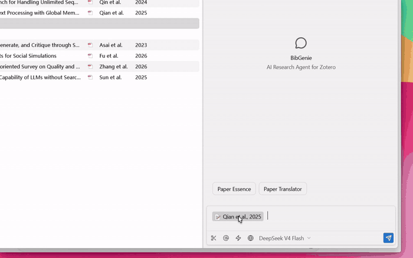
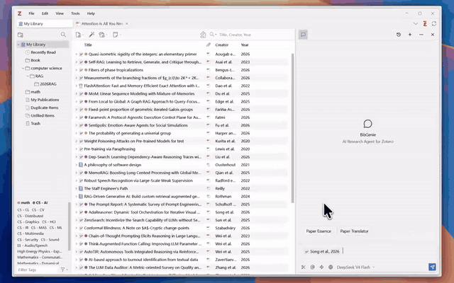
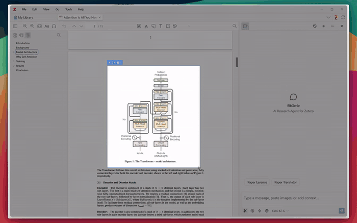
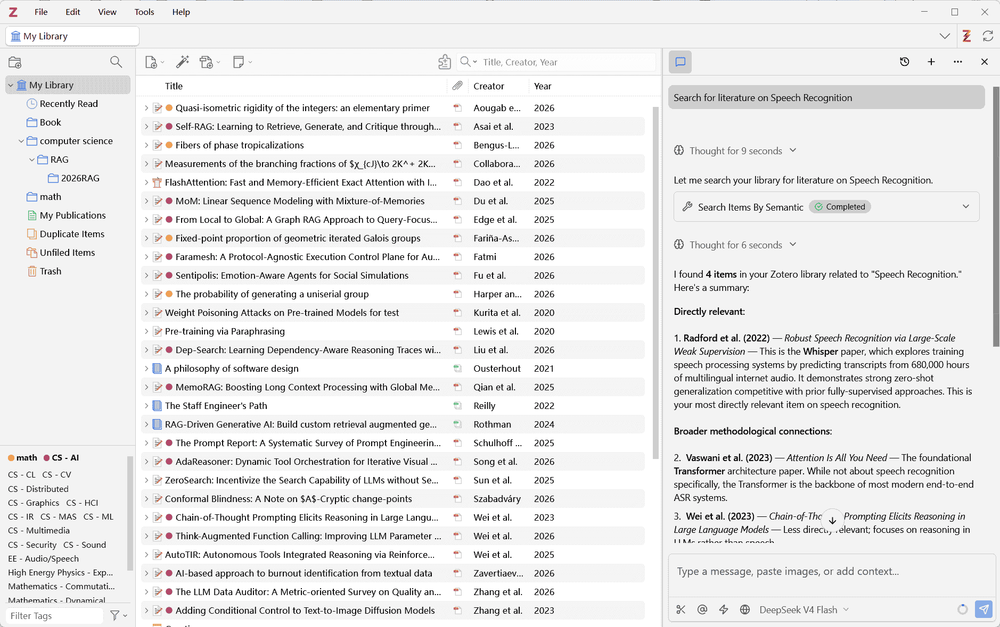
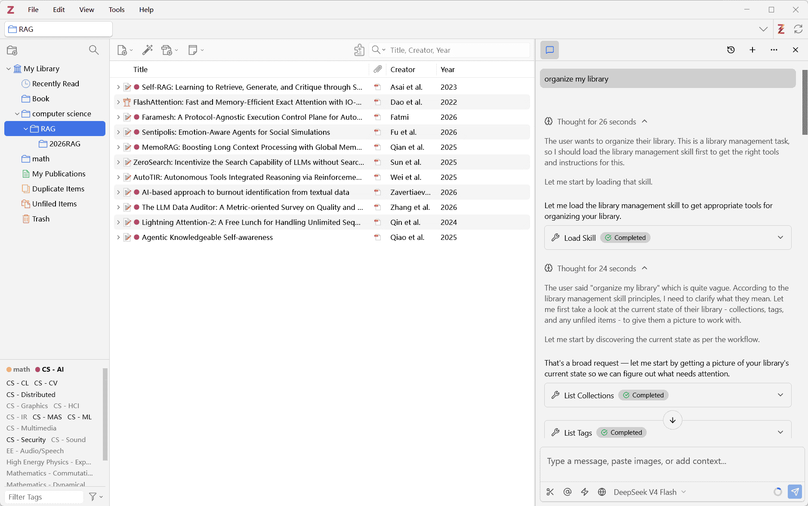

  

  # BibGenie

  ### AI Research Agent for Zotero

  [English](README.MD) | [简体中文](README_ZH.MD)

  
  
  
  
  
  

  **BibGenie works natively inside Zotero with your papers, notes, snapshots, images, and library structure. Add research context, ask grounded questions, search and organize your library, then save useful results back to Zotero notes.**

  [Download Free Plugin](https://www.bibgenie.com/download) · [Documentation](https://www.bibgenie.com/docs) · [Join Discord](https://discord.gg/kDXFAAYDNE)

---

## A Native Zotero Research Workflow

BibGenie is not a separate web chatbot that requires you to move research material out of Zotero. It is an AI research agent in the Zotero sidebar, designed around the materials and organization you already use.

1. **Add context**: insert Zotero items, PDF attachments, saved web snapshots, notes, selected text, page context, images, screenshots, tags, or collections.
2. **Ask and search**: read papers, explain figures and formulas, search your library, compare articles, or synthesize a literature set.
3. **Organize and preserve**: save responses as Zotero notes and use reviewable workflows for tags, collections, and metadata.

  
   
  Research workflow preview: add context, read a paper, and save the result. <a href="https://cfr2.bibgenie.com/bibgenie-mp4s/add_context_read_save_lq.mp4">View full-quality video</a>

## Core Features

### Add Any Zotero Context

Bring your workspace into the conversation rather than copying research material into a separate chatbot:

- Type `@` or use Zotero's **Add to Chat** entry points to add items, PDFs, notes, snapshots, tags, and collections.
- Add selected passages, current-page context, figures, pasted images, and screenshots.
- Ask grounded questions about the paper, project, or literature set in view.

  
   
  Add Zotero material with <code>@</code>. <a href="https://cfr2.bibgenie.com/bibgenie-mp4s/at_any_context.mp4">View full-quality video</a>

Figures and screenshots are context too. BibGenie can explain a diagram, formula, or page region without leaving the Zotero reader.

  
   
  Discuss figures and screenshots in the reader. <a href="https://cfr2.bibgenie.com/bibgenie-mp4s/explain_image.mp4">View full-quality video</a>

### Search, Read, and Synthesize Your Library

- Find papers by title, author, year, DOI, tag, collection, journal, or conference.
- Use semantic search over the local index of Zotero item titles and abstracts.
- Deep-read papers, compare multiple articles, generate structured tables, and save useful results as Zotero notes.

  

### Organize Your Zotero Library

- Inspect and organize tags, collections, item movement, and metadata.
- For sensitive batch operations, ask BibGenie for a plan, review affected items, then explicitly apply the changes.

  

### Choose the Model Setup That Fits Your Research

- Start immediately with BibGenie's official model options; no API key is required for the first question.
- Connect OpenAI, Anthropic, DeepSeek, Gemini, OpenRouter, Groq, or OpenAI-compatible endpoints with your own key.
- Use Ollama or LM Studio for local inference. Custom and local model requests go directly to the provider or runtime you configure.

### Extend the Workflow With Web Research and Zotero MCP

- Paid plans add **Web Search**, **Web Extract**, and **OpenAlex Academic Search** for discovering public scholarly metadata, exploring citation networks, and analyzing research trends beyond your library.
- The built-in local **Zotero MCP** server lets MCP-compatible clients such as Cursor, Claude Code, Claude Desktop, and Cherry Studio work with Zotero context.
- Through MCP, trusted external clients can search items, read attachments or snapshots, create notes, and manage library metadata locally.

## Install BibGenie

### Requirements

- Zotero 7, Zotero 8, or Zotero 9
- Windows, macOS, or Linux

### Installation

1. Download the latest `.xpi` plugin from the [BibGenie download page](https://www.bibgenie.com/download) or [GitHub Releases](https://github.com/BaiRuic/BibGenie/releases).
2. In Zotero, open **Tools -> Plugins**.
3. Click the gear icon and choose **Install Plugin From File...**.
4. Select `bibgenie-<version>.xpi`, then restart Zotero.
5. Open BibGenie from the Zotero toolbar or **Tools -> BibGenie**.

BibGenie checks for updates when Zotero starts. Automatic updates can also be enabled for BibGenie in Zotero's Plugin Manager.

## Plans and Privacy

- **Free** includes the core Zotero research agent, context tools, library search, Save as Note, custom models, and monthly official-model credits.
- **Pro / Max / Lifetime** provide larger official-model allowances; paid plans include Web Search / Web Extract / OpenAlex Academic Search.
- **BYOK and local models** do not consume BibGenie official-model credits; provider cost or local compute remains yours.
- Chat records are stored locally in Zotero by default. When using a custom or local model, requests are sent directly to the configured provider or runtime.

Current pricing and credit details are maintained on the [Pricing page](https://www.bibgenie.com/pricing) and in the [documentation](https://www.bibgenie.com/docs/pricing-credits).

## Learn More

- [Getting Started](https://www.bibgenie.com/docs/getting-started)
- [Add Context](https://www.bibgenie.com/docs/add-context)
- [Literature Search](https://www.bibgenie.com/docs/literature-search)
- [OpenAlex Academic Search](https://www.bibgenie.com/docs/openalex-research)
- [Models and BYOK](https://www.bibgenie.com/docs/models)
- [Zotero MCP](https://www.bibgenie.com/docs/mcp)

## About This Repository

This repository is the public home for BibGenie product information and downloadable releases. The BibGenie application source code is not published in this repository.

## Support

- Website: [www.bibgenie.com](https://www.bibgenie.com)
- Documentation: [www.bibgenie.com/docs](https://www.bibgenie.com/docs)
- Discord: [Join the community](https://discord.gg/kDXFAAYDNE)
- Email: [support@bibgenie.com](mailto:support@bibgenie.com)

  <strong>Bring your Zotero library into an AI-native research workflow.</strong>
    
  <a href="https://www.bibgenie.com/download"><strong>Download BibGenie</strong></a>

